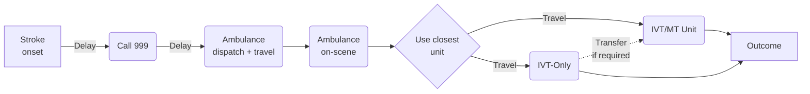
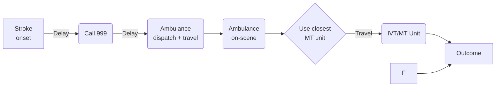
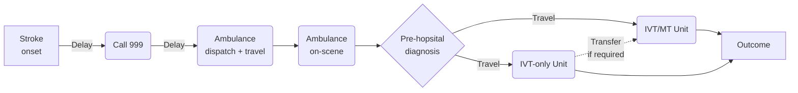

# Stroke Pathway Model with MSUs (Determinstic model per LSOA)

Simpy pathway model for stroke thrombolysis and thrombectomy. This models compares the outcome difference between two models of care:

## Models of care

### Drip and Shaip



### Mothership



### Pre-hopsital diagnosis




### Mobile Stroke Unit (MSU)

```mermaid
flowchart LR
    A[Stroke\nonset] --> |Delay| B(Call 999)
    B --> |Delay| C(MSU dispatch\n+ travel)
    C --> D(MSU\non-scene)
    D --> E(On-scene IVT)
    E --> G |Travel| (MT Unit)
    G --> H[Outcome]
    F --> H
```