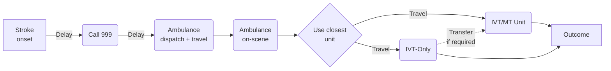
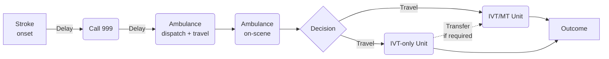

# Stroke Pathway Model with MSUs (Determinstic model per LSOA)

Simpy pathway model for stroke thrombolysis and thrombectomy. This models compares the outcome difference between two models of care:

## Drip and Shaip

